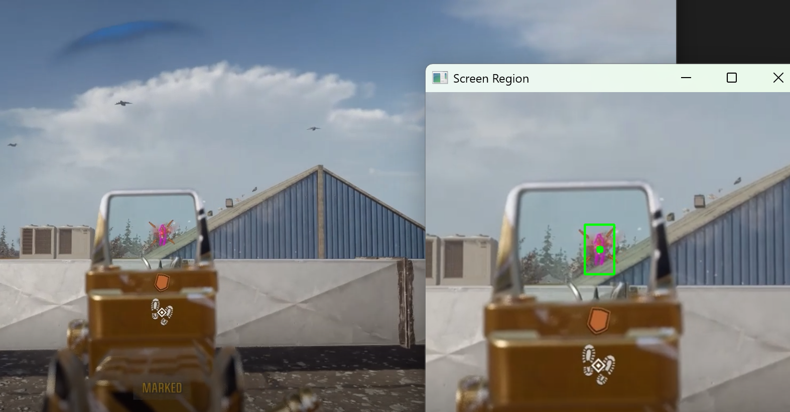
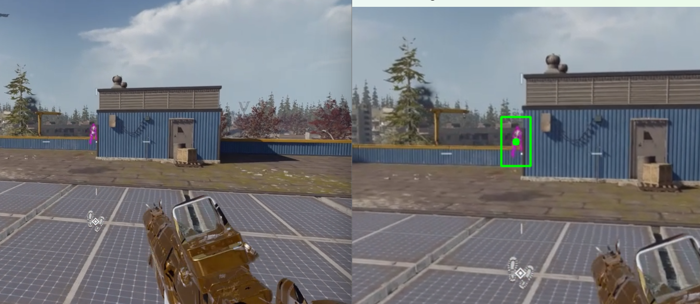

# Color-Based Aim and Trigger Bot for Video Games

This project is a **color-based aim and trigger bot** designed specifically for video games. It detects targets based on their color and automates aiming and shooting through real-time image processing.

---

## Important Notice

This project is **not** a plug-and-play tool. It is not intended for cheating in online games, and therefore does not include automated features that work out-of-the-box. You should study the implementation carefully and adapt it responsibly for your own offline or permitted use cases.

---

## Features

- Real-time color segmentation to detect targets
- Aiming assistance based on chosen color
- Trigger bot functionality for automatic shooting

---

## Requirements

- C++ compiler (Visual Studio recommended)
- OpenCV library
- Basic understanding of computer vision and image processing

---

## Usage

1. Please do not use this...

---

## Disclaimer

This software is provided as-is. Use it responsibly and at your own risk. Be aware that using such tools may violate the terms of service of the games you play and could result in penalties, including bans.

---

## License

You have my **License to Kill** — permission to use this code to dominate your enemies (offline), but remember: with great power comes great responsibility. Use wisely and play fair outside the game.

EXAMPLE IMAGES ARE FROM A VIDEO AND NOT FROM A REAL GAME. DO NOT CHEAT IN ONLINE GAMES

